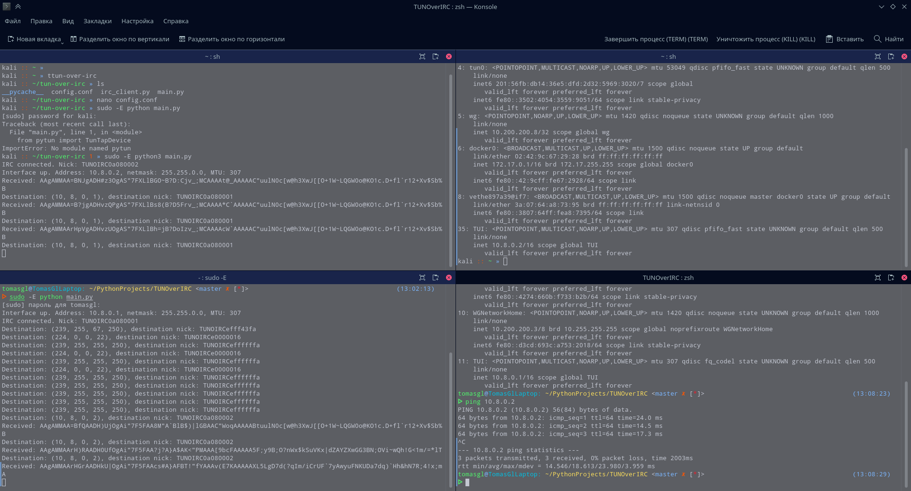
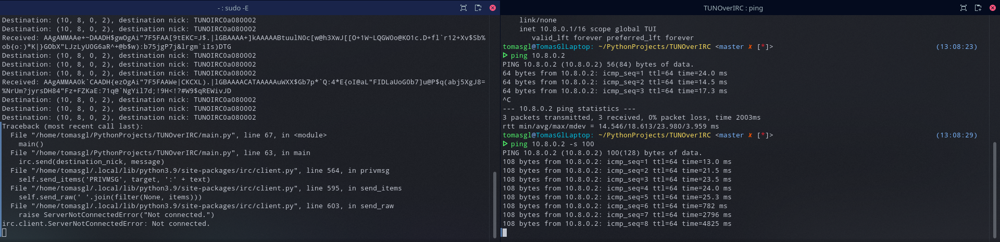

TUNOverIRC
==========
TUNOverIRC - это **экспериментальный** виртуальный сетевой адаптер работающий через IRC сеть.


Installing
----------
```bash
sudo pip3 install python-pytun irc base91 multipledispatch
git clone ...
```
:exclamation: Если не удалось установить python-pytun, скомпилируйте вручную
[отсюда](https://github.com/montag451/pytun).


Using
-----
На каждый клиент необходимо склонировать данный репозиторий.
Открыть файл config.conf и настроить адресацию и используемый irc сервер.
В конечном итоге запустить программу на обоих машинах командой: 
```
sudo -E python3 main.py
```
Можете проверить пинг:)

:grey_exclamation: Скрипт подойдет для протоколов с малым трафиком
(пинг, чаты, почта, и тд). IRC сервер просто начинает задерживать сообщения,
в случае если трафика много.
Прокинуть сайт и ssh у меня не получилось.


Screenshots
-----------

Слишком большие пакеты ping-а:

В итоге кик от сервера:

